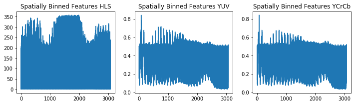

# Self-Driving Car Engineer Nanodegree
<p align="center">
    
</p>

## Vehicle Detection - Project 5

<p align="center">
    
</p>

## Dataset
Here are links to the labeled data for [vehicle](https://s3.amazonaws.com/udacity-sdc/Vehicle_Tracking/vehicles.zip) and [non-vehicle](https://s3.amazonaws.com/udacity-sdc/Vehicle_Tracking/non-vehicles.zip) examples to train your classifier.

Project's steps:

* Axtract a HOG (Histogram of Oriented Gradients) features af a image dataset and train a Linear SVM classifier


* [Optional]You can also apply a color histogram and append binned color features to your HOG feature vector. 


* Note: Don't forget to normalize your features and shuffle it for training and testing.


* Implement a sliding-window technique into down side of your image and use your trained classifier to search for vehicles in images.


* Run your pipeline on a video stream and create a heat map of recurring detections frame by frame to reject outliers and follow detected vehicles.


* Estimate a bounding box for vehicles detected.

In this README, each step of the pipeline will be explained.

## Files

* `./veihicle_detect_P5.ipynb` : main code for this project 

* `data` : contains a link to the `vehicles` and `non-vehicles` datasets

* `output_images` : images used to illustrate the steps taken to complete this project

* `test_images` : images used to test the functions in this project

* `test_videos` : original videos provided by Udacity and their processed outputs

* `README.md` : readme file


### Loading and Visualizing the data

For this project I used the **`vehicle`** and **`non-vehicle`** datasets provided by [Udacity](https://github.com/udacity/CarND-Vehicle-Detection). Below is are 6 random images from the **`vehicle`** and **`non-vehicle`** datasets.

<p align="center">
    
</p>

### Return HOG features and visualization

The **`get_hog_features`** function takes in an image and computes the Histogram of Oriented Gradient (HOG) features in it using the **`hog()`** function from the [scikit-image](http://scikit-image.org/docs/dev/api/skimage.feature.html?highlight=feature%20hog#skimage.feature.hog) package. Below is the visualization of the **`get_hog_features`** function.

<p align="center">
    
</p>


### Compute Color Histogram features and visualizing the results

The **`color_hist`** function computes Color Histogram features labeled **`hist_features`**.  Below is the visualization of the **'R' 'G' and 'B'** channels from a `car_image`.

<p align="center">
    
</p>


### Spatial Binning of Color features and visualizing the results

The **`bin_spatial`** function takes in an image, a color space, and a new image size and returns a feature vector. Useful for extracting color features from low resolution images. Below is an example of spatially binned color features extracted from an image before and after resizing. 

<p align="center">
    
    
    
    
    
    
</p>


### Extracting features from a image list 

The **`extract_features`** function etracts the features returned by the **`bin_spatial`**, **`color_hist`** and **`get_hog_features`** functions. Each functions has a `True` flag assigned to it so that the features can be extracted individually or all at once. 
  
### Training and testing the HOG Support Vector Classifier and the Color Histogram Support Vector Classifier

After extracting HOG and color features from the **`car_images`** and **`noncar_images`** I test the accuracy of the SVC by comparing the predictions on labeled `X_train` data. Test Accuracy of HOG based SVC is 97.38% and the test Accuracy of Color Histogram based SVC is 96.68%.


### Sliding Window Implementation

The **`slide_window`** function takes in an image -> start and stop positions -> window size -> overlap fraction ->  returns a list of bounding boxes for the search windows, which will then be passed to draw boxes. Below is an illustration of the **`slide_window`** function with adjusted `y_start_stop` values [400, 656].

<p align="center">
    
</p>

### Defining a function to extract features from a single image window

The **`single_img_features`** function is very similar to the *`extract_features`* function. One extracts HOG and color features from a list of images while the other extracts them from one image at a time. The extracted features are passed on to the **`search_windows`** function which searches windows for matches defined by the classifier. The following parameters were used to extact feautures of `cars` and `noncars` from the datasets.

```python

color_space = 'YCrCb' # Can be RGB, HSV, LUV, HLS, YUV, YCrCb
orient = 10  # HOG orientations
pix_per_cell = 8 # HOG pixels per cell
cell_per_block = 2 # HOG cells per block
hog_channel = 'ALL' # Can be 0, 1, 2, or "ALL"
spatial_size = (32, 32) # Spatial binning dimensions
hist_bins = 64  
spatial_feat = True 
hist_feat = True
hog_feat = True
```
Test Accuracy of SVC is 98.87%

<p align="center">
    
</p>

### Adding Heatmaps and Bounding Boxes

The **`add_heat`** function creates a map of positive "car" results found in an image by adding all the pixels found inside of search boxes. More boxes means more "hot" pixels. The **`apply_threshold`** function defines how many search boxes have to overlap for the pixels to be counted as "hot", as a result the "false-positve" search boxes can be discarded. The **`draw_labeled_bboxes`** function takes in the "hot" pixel values from the image and converts them into labels then draws bounding boxes around those labels. Below is an example of these functions at work.

<p align="center">
    
</p>

### Defining a function that can extract features using HOG sub-sampling and make predictions

The **`find_cars`** function extracts the HOG and color features, scales them and then makes predictions. Using multiple scale values allows for more accurate predictions. I have combined scales of **`1.0, 1.5`** and **`2.0`** with their own `ystart` and `ystop` values to lower the ammount of false-postive search boxes. 

### Conclusion

1. During the creation of this project, I have learned a great deal about color spectrums, image gradients and support vector classifiers. Even though this method of image recognition is not likely to be used in vehicle detection due to it's incredibly slow processing speed it was a great learning tool for me due to its customizability. 
2. In the future I would like to try using deep-learning for vehicle recognition, perhaps using the ["You only look once"](https://pjreddie.com/darknet/yolo/) method.
3. The pipeline used in this project tends to do poorly when areas of the image darken by the presence of shadows. Classifying dark pixels as `cars`, creating false-positives. This issue could be resolved by adding more dark images to the `non-vehicle` dataset.
4. For the purpose of this project, `xstart` and `xstop` could also be implemented as the left outer portion of the frame is mostly useless and creates a lot of false-positives.

<p align="center">
    
</p>
